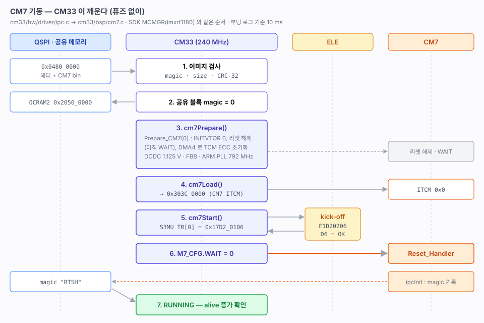
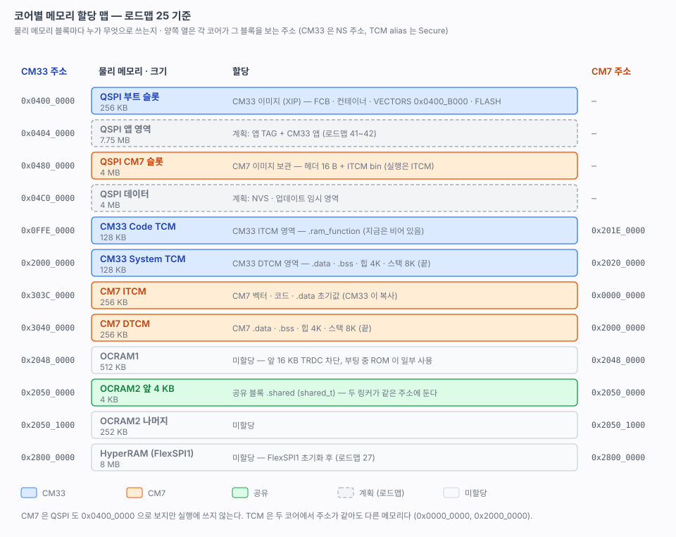

# 25. CM7 기동

> 퓨즈를 굽지 않고 CM33 이 CM7 을 깨운 기록. CM7 이미지 형식, 오버드라이브 전압과 ARM PLL, EdgeLock(ELE) kick-off 명령, 공유 블록 핸드셰이크를 다룬다.
> 관련: [01-boot-sequence.md](01-boot-sequence.md) 6절 · [02-memory-map.md](02-memory-map.md) 1절, 5절 · [22-clock.md](22-clock.md)
>
> 출처: SDK `system_MIMXRT1186_cm33.c` (`Prepare_CM7`), `mcux-mcmgr` `src/mcmgr_internal_core_api_imxrt1180.c` (`mcmgr_start_core_internal`), `frdmimxrt1186/multicore_examples` (`hello_world`, `clock_config.c`), `board.c` (`DCDC_SetVoltage`), IMXRT1180EC 데이터시트 (Over Drive Run).



---

## 1. 결과

```
[OK] CM7 RUNNING (10 ms)
     name  : FRDM-IMXRT1186-CM7
     ver   : V261010R1
     clock : 792 MHz

cli# ipc info
state      : RUNNING
image      : 0x04800000 magic 0x37434D52 size 9940 crc 0x6F1733DA (calc 0x6F1733DA)
ele resp   : 0xE1D20206 0x000000D6 (err 0)
alive      : 249  (+52 / 500ms)
```

`clock info` 의 M7 루트 실측은 **792.05 MHz** 다. CM33 은 그대로 240 MHz 다.

## 2. 구조

titan-mini 의 CPU1 기동과 같은 틀이다. 공유 블록 핸드셰이크, `ipc` 공개 API, `BUILD_*` 옵션을 그대로 따른다. 다른 점은 이미지 위치와 깨우는 방법이다.

| | titan-mini (RA8P1) | 여기 (RT1186) |
|---|---|---|
| 상대 코어 이미지 | MRAM 의 자기 파티션에서 실행 | **QSPI CM7 슬롯 → CM7 ITCM 으로 복사해서 실행** |
| 깨우기 | FSP `R_BSP_SecondaryCoreStart()` | **ELE 에 kick-off 명령 + M7_CFG.WAIT 해제** |
| 공유 블록 | SRAM 끝 non-cacheable | OCRAM2 `0x2050_0000` (두 코어가 같은 주소로 본다) |

| 파일 | 역할 |
|---|---|
| `cpu/shared/shared.h` | 두 코어의 규약 — CM7 이미지 헤더 `cm7_image_t`, 공유 블록 `shared_t` |
| `cpu/cm33/bsp/cm7.c` | 레지스터 수준 기동 — `cm7Prepare`, `cm7Load`, `cm7Start` |
| `cpu/cm33/hw/driver/ipc.c` | 주 코어 — 이미지 검사, 기동, 핸드셰이크, `ipc info` |
| `cpu/cm7/hw/driver/ipc.c` | 상대 코어 — 자기소개 후 magic, `ipcUpdate()` 로 alive 증가 |
| `cpu/cm7/` | CM7 프로젝트 — main → bsp → hw → ap (titan-mini cm33 과 같은 최소 구성) |
| `tools/mkcm7img.py` | CM7 bin 앞에 헤더를 붙여 `.img` 를 만든다 |

### 메모리 할당



두 링커 스크립트가 잡은 영역이다. 사용량이 아니라 **어느 코어가 어느 영역을 무엇으로 쓰는지**다. 그림은 주소를 한 축으로 두고 같은 행에 두 코어가 그 주소에서 보는 것을 나란히 그렸다. 노란 테두리 행(`0x0000_0000`, `0x2000_0000`)은 같은 주소가 두 코어에서 서로 다른 메모리다. 빈 칸은 그 코어에서 매핑이 없는 주소다.

| 물리 메모리 | CM33 주소 | CM7 주소 | 링커 영역 | 할당 |
|---|---|---|---|---|
| QSPI 부트 슬롯 256 KB | `0x0400_0000` | — | cm33 `FCB` `CONTAINER` `VECTORS` `FLASH` | CM33 이미지 (XIP) |
| QSPI CM7 슬롯 4 MB | `0x0480_0000` | — | (링커 밖, `flash` 타깃이 `.img` 를 씀) | CM7 이미지 보관 |
| CM33 Code TCM 128 KB | `0x0FFE_0000` | `0x201E_0000` | cm33 `ITCM` | `.ram_function` |
| CM33 System TCM 128 KB | `0x2000_0000` | `0x2020_0000` | cm33 `DTCM` | `.data` `.bss` 힙 4K 스택 8K |
| CM7 ITCM 256 KB | `0x303C_0000` | `0x0000_0000` | cm7 `ITCM` | 벡터 · 코드 · `.data` 초기값 |
| CM7 DTCM 256 KB | `0x3040_0000` | `0x2000_0000` | cm7 `DTCM` | `.data` `.bss` 힙 4K 스택 8K |
| OCRAM2 앞 4 KB | `0x2050_0000` | `0x2050_0000` | cm33 · cm7 `SHARED` | `.shared` (`shared_t`) |
| OCRAM1, OCRAM2 나머지, HyperRAM | | | — | 미할당 |

QSPI 의 앱 영역(`0x0404_0000`)과 데이터 영역(`0x04C0_0000`)은 파티션 계획만 있다([02](02-memory-map.md) 5절).

## 3. CM7 이미지

| 단계 | 결과물 |
|---|---|
| 링크 | `rt1180-fw-cm7.elf` — **CM7 ITCM `0x0`** 에 링크. 벡터 · 코드 · `.data` 초기값이 ITCM 한 덩어리 |
| objcopy | `rt1180-fw-cm7.bin` — ITCM 덩어리 (NOLOAD 인 `.bss`, `.shared` 는 빠진다) |
| `mkcm7img.py` | `rt1180-fw-cm7.img` — 16 B 헤더 + bin |
| `flash` 타깃 | `.img` 를 QSPI **`0x0480_0000`** (CM7 슬롯, [02](02-memory-map.md) 5절)에 bin 으로 쓴다 |

헤더(`cm7_image_t`)는 다음과 같다.

| 오프셋 | 필드 | 값 |
|---|---|---|
| 0 | magic | `0x37434D52` ("RMC7") |
| 4 | size | 헤더 뒤 바이트 수 (≤ 256 KB) |
| 8 | crc32 | IEEE 802.3 반사형 (`zlib.crc32` 와 같다) |
| 12 | reserved | 0 |

CM33 은 기동 전에 셋을 다 확인한다. 하나라도 틀리면 `NO_IMAGE` 로 남고 CM7 을 깨우지 않는다. 빈 플래시나 낡은 이미지로 뛰지 않기 위해서다.

### SDK 와 다른 점

SDK 멀티코어 예제(`multicore_examples/hello_world`)도 CM7 을 **ITCM 에서 돌린다.** 이 보드의 `frdmimxrt1186@cm7` 빌드 목록은 RAM 타깃(`cm7_ram.ld`)만 켜져 있다. `flexspi_nor`(XIP)와 `hyperram` 타깃은 꺼져 있다. CM33 이 `0x303C_0000` 에 복사하고 `MCMGR_StartCore()` 로 깨우는 것도 같다.

다른 것은 CM7 이미지를 어디에 담느냐다.

| | SDK | 여기 |
|---|---|---|
| CM7 이미지 위치 | **CM33 이미지 안.** CM7 bin 을 CM33 링크 때 `.core1_code` 섹션으로 넣는다 (`core1_image_start`, 최대 256 KB) | **별도 QSPI 슬롯** `0x0480_0000` + 헤더 |
| 검증 | 없음. 같은 이미지라 짝이 항상 맞는다 | magic · 크기 · CRC, 공유 블록 version |
| 기록 | CM33 하나 | `.img` 와 CM33 elf 둘 |
| 장점 | 한쪽만 기록해 짝이 어긋날 일이 없다 | 코어별 ELF (titan-mini 와 같다), 파티션 계획과 맞는다, 부트로더가 CM7 만 따로 갱신할 수 있다 |

어느 쪽으로 갈지는 부트로더 설계(로드맵 40)에서 다시 정한다.

### 왜 elf 를 바로 쓰지 않나

CM7 elf 의 주소는 CM7 ITCM(`0x0`)이다. probe-rs 에 그대로 넘기면 ITCM 에 쓰려고 하고, 리셋하면 사라진다. 그래서 bin 으로 떠서 플래시 슬롯에 쓰고, 실행 위치로는 CM33 이 매 부팅 복사한다. 부트로더가 생기면(로드맵 44) 같은 형식을 그대로 쓴다.

## 4. 깨우는 순서 — `bsp/cm7.c`

### 4-1. `cm7Prepare()`

| 순서 | 내용 | 출처 |
|---|---|---|
| 1 | `Prepare_CM7(0)` | SDK `system_MIMXRT1186_cm33.c`. PHY_LDO, ARM PLL 전원, DCDC REG3 을 설정하고 `M7_CFG.INITVTOR = 0` 과 `SRC SCR.BT_RELEASE_M7` 을 쓴다. 그리고 **DMA4 로 CM7 ITCM/DTCM 512 KB 를 64 bit 쓰기로 채운다** |
| 2 | DCDC CORE0/1 → **1.125 V**, `PMU_EnableFBB(true)` | 오버드라이브. CM7 792 MHz 에 필요하다 (SDK 멀티코어 `clock_config.c`) |
| 3 | `CLOCK_InitArmPll` 24 MHz × 132 / 4 = **792 MHz** (락 대기) | 〃 |
| 4 | M7 루트 = ARM PLL ÷ 1 | 〃 |

`BT_RELEASE_M7` 은 리셋을 풀 뿐이고 CM7 은 아직 **WAIT** 에 묶여 있다. 그래서 그 뒤에 TCM 을 채우고 이미지를 복사해도 안전하다.

TCM 을 DMA 64 bit 쓰기로 채우는 이유는 ECC 다. 초기화되지 않은 TCM 에 32 bit 이하로 쓰면 하드웨어가 읽기-수정-쓰기를 하는데, 이때 읽은 쪽 ECC 가 깨져 있어 오류가 난다. 한 번 64 bit 로 채워 두면 그다음부터는 32 bit 복사가 된다.

> 데이터시트 기준 CM7 은 Over Drive Run 에서 800 MHz 까지다. SDK 도 792 MHz 를 쓴다. 정수 루프 분주로 만들 수 있는 가장 가까운 값이다.

> SDK `board.c` 의 `DCDC_SetVoltage()` 는 DCDC 설정을 ELE `VOLTAGE_CHANGE_START/FINISH` 로 감싼다. SDK 주석에 따르면 GDET(전압 글리치 검출)를 쓰는 특수 ELE 펌웨어에서만 필요하고, 일반 ELE ROM 은 그 명령을 오류로 응답하고 무시한다. GDET 를 쓰지 않으므로 `DCDC_SetVDD1P0BuckModeTargetVoltage()` 를 바로 부른다.

### 4-2. `cm7Load()`

QSPI 슬롯의 이미지(헤더 뒤)를 **`0x303C_0000`** 에 32 bit 로 복사한다. CM33 에서 본 CM7 ITCM 의 Secure alias 다([02](02-memory-map.md) 1절).

### 4-3. `cm7Start()` — ELE kick-off

**CM7 은 레지스터만으로는 시작되지 않는다.** EdgeLock Enclave 에 S3MU 메일박스(`MU_RT_S3MUA`)로 명령을 보내야 한다. MCMGR 의 `mcmgr_start_core_internal()` 과 같다.

| 순서 | 동작 | 값 |
|---|---|---|
| 1 | `TSR.TE0` 를 기다려 `TR[0]` 에 쓴다 | `0x17D2_0106` — tag 0x17, cmd 0xD2, size 1, ver 6 |
| 2 | `RSR.RF0`, `RF1` 을 기다려 `RR[0]`, `RR[1]` 을 읽는다 | **`0xE1D2_0206`, `0x0000_00D6`** (0xD6 = 성공) |
| 3 | M7 LPCG 끄기 → `M7_CFG.WAIT = 0` → 켜기 | CM7 이 `Reset_Handler` 부터 돈다 |

응답은 실패든 성공이든 반드시 읽는다. 읽지 않으면 메일박스가 다음 명령을 받지 않는다. 각 대기에는 폴링 상한을 두었다. 실패하면 `START_FAIL` 과 오류 코드(`ele resp … err N`)가 남는다.

## 5. 핸드셰이크

titan-mini 와 같다([ipc.h](../rt1180-fw/src/common/hw/include/ipc.h) 주석).

1. CM33 이 공유 블록 `magic` 을 0 으로 지운다. 공유 블록은 NOLOAD 라 리셋 뒤에도 남는다. 지우지 않으면 이전 세션의 magic 이 유효해 보인다.
2. CM33 이 기동한다.
3. CM7 의 `ipcInit()` 이 자기 필드를 채운다. 채우는 것은 version, 클럭, 이름, 버전이다. 그다음 `__DMB()` 를 하고 **magic 을 마지막에 쓴다.**
4. CM33 은 500 ms 안에 magic 이 서는지 본다. 그다음 version 을 비교해 `RUNNING` 이나 `BAD_VERSION` 을 정한다.
5. 이후 CM7 은 10 ms 마다 `peer_alive` 를 올린다. CM33 의 `ipcIsRunning()` 은 100 ms 동안 증가가 없으면 죽은 것으로 본다.

| 상태 | 뜻 |
|---|---|
| `DISABLED` | `BUILD_CM7=OFF` — 깨우지 않는다 |
| `NO_IMAGE` | 슬롯에 유효한 이미지가 없다 |
| `START_FAIL` | ELE 응답 실패 |
| `TIMEOUT` | 깨웠는데 magic 이 안 선다 |
| `BAD_VERSION` | 한쪽만 다시 빌드했다 |
| `RUNNING` | 정상 |

## 6. 빌드와 기록

```bash
cmake -S . -B build -G Ninja -DBUILD_CM7=ON     # 한 번. 캐시에 남는다
cmake --build build                              # cm33 elf + cm7 elf/bin/img
cmake --build build --target flash               # cm7.img → 0x0480_0000, cm33.elf, 리셋
```

| 빌드 | ITCM | DTCM | 이미지 |
|---|---|---|---|
| CM7 | 9,940 B / 256 KB | 12,824 B / 256 KB | 9,940 B + 헤더 16 B |
| CM33 | — | — | FLASH 47,800 B / 211 KB |

`BUILD_CM7=OFF`(기본)로도 경고 없이 빌드된다. 그 경우 `ipc info` 의 state 는 `DISABLED` 다.

VSCode 태스크의 `build-configure` 는 `-DBUILD_CM7` 을 넘기지 않는다. 한 번 ON 으로 configure 하면 CMake 캐시에 남는다.

## 7. 걸렸던 것 / 확인한 것

- **TRDC 는 필요 없었다.** SDK 예제는 시작할 때 `BOARD_CommonSetting()` 으로 TRDC 권한을 연다. 그런데 CM7 이 OCRAM2 공유 블록에 쓰는 데는 따로 열 필요가 없었다. 주변장치를 CM7 이 쓸 때 다시 본다.
- **CM7 D-cache 는 아직 꺼져 있다.** CM7 `SystemInit()` 은 캐시를 켜지 않는다. 그래서 공유 블록 일관성 문제가 없다. 캐시를 켜면 MPU 로 OCRAM2 공유 구간을 non-cacheable 로 잡아야 한다.
- **`Prepare_CM7` 의 TCM 채우기 원본은 OCRAM1 `0x2048_4000` 의 한 워드다.** SOFF 0 으로 같은 값을 반복해서 쓴다. 0 이 아닐 수도 있지만 ECC 만 맞으면 되고, 이미지 복사와 CM7 startup 의 `.bss` 클리어가 덮어쓴다.

## 8. 다음 (25b)

- [ ] probe-rs 에 CM7 코어 정의 추가 (AP 2) — 커스텀 타깃 yaml, `rt1180-fw-cm7.code-workspace` 의 디버그 구성
- [ ] CM7 캐시 켜기 + MPU 로 공유 구간 non-cacheable
- [ ] MU(Message Unit) 로 코어 간 메시지/인터럽트
- [ ] 전원 재인가(SW2)에서도 CM7 이 기동하는지 확인 — 지금은 소프트 리셋으로만 확인했다
