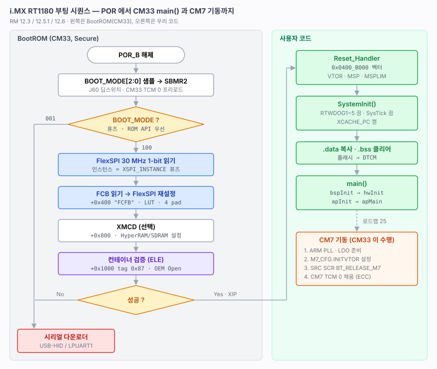
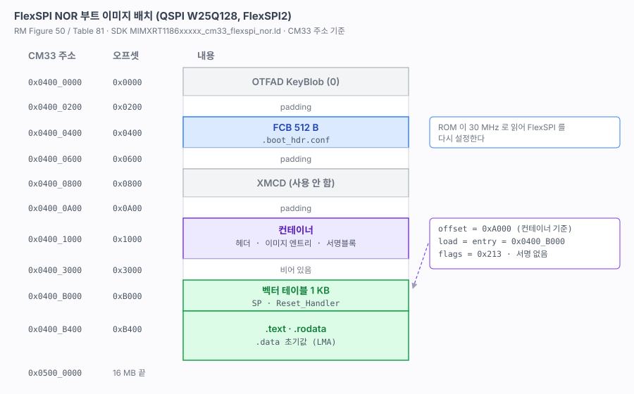
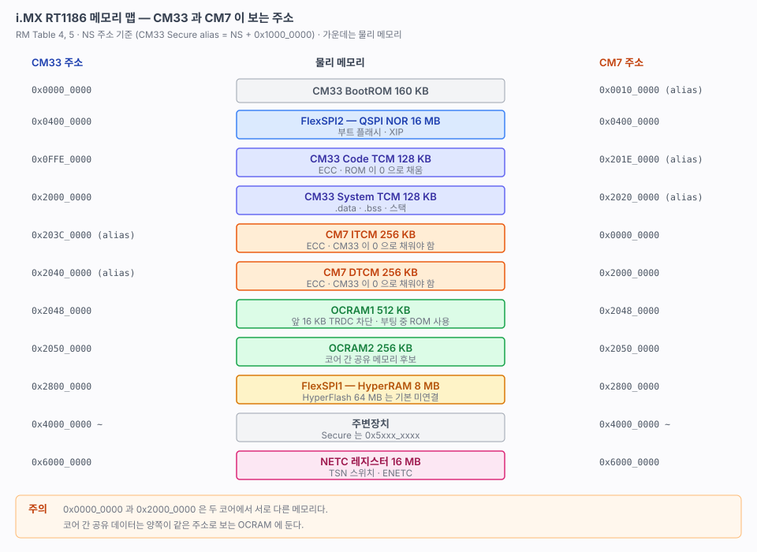
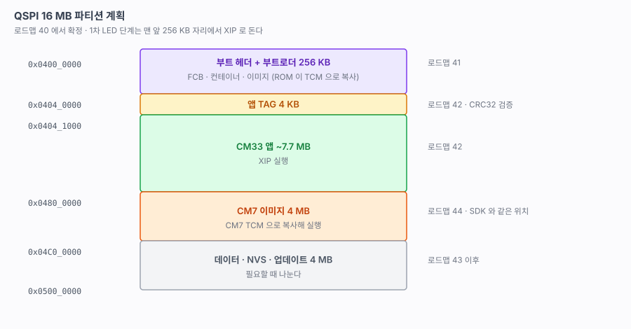
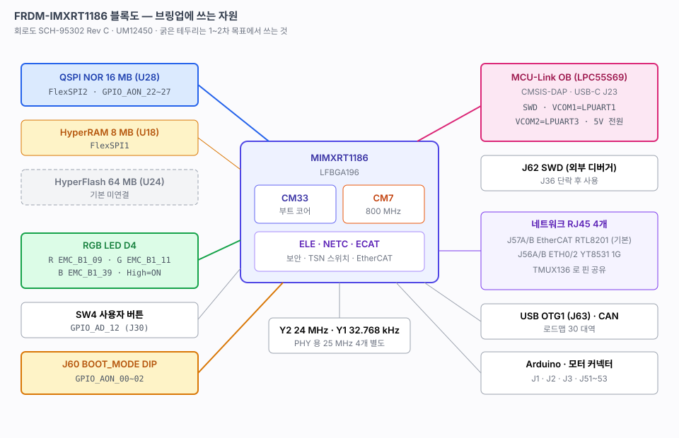
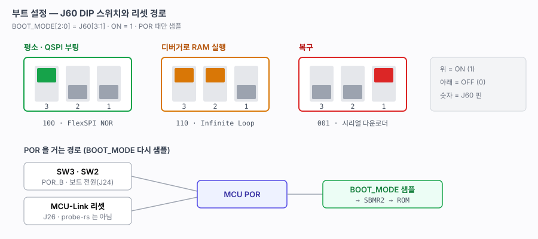
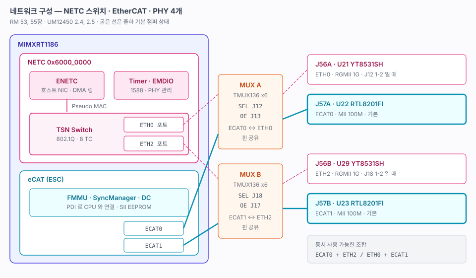
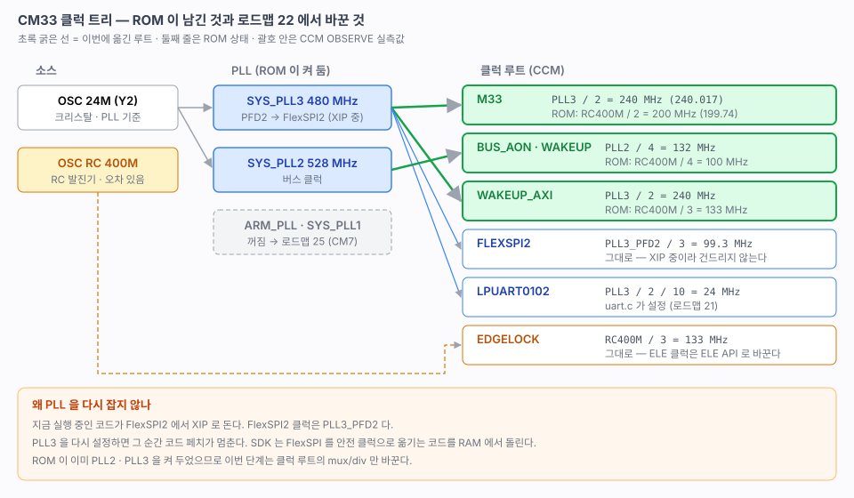
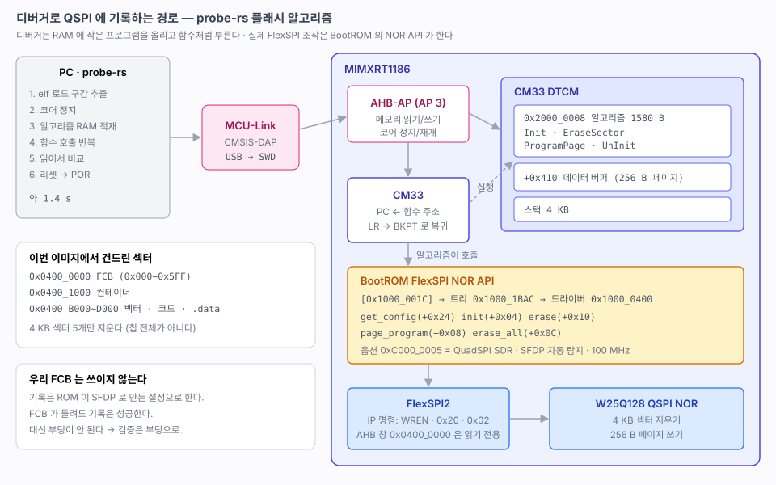

# FRDM-IMXRT1186 펌웨어 문서

i.MX RT1186(Cortex-M33 부트 코어 + Cortex-M7 800 MHz, EdgeLock, NETC TSN 스위치, EtherCAT) 기반 FRDM-IMXRT1186 보드의 브링업 기록. 제조사 IDE/SDK 를 설치하지 않고 gcc + CMake + Ninja + probe-rs 만으로 진행한다.

## 현재 상태 (2026-10-09)

| | |
|---|---|
| 보드 | FRDM-IMXRT1186 (SCH-95302 Rev C) · MCU `MIMXRT1186CVJ8C` (LFBGA196) |
| 디버거 | 온보드 MCU-Link (CMSIS-DAP) · probe-rs 0.32 |
| 펌웨어 | `firmware/rt1180-fw` — CM33 **LED · UART(LPUART1) · CLI · 로그 · 240 MHz · 버튼 · swtimer · RTC · reset** |
| 부팅 | QSPI(W25Q128, FlexSPI2) XIP · 서명 없는 컨테이너 · 부트 헤더 직접 생성 |
| 클럭 | CM33 **240 MHz** (SYS_PLL3 ÷ 2, Normal Drive) · 버스 132 MHz · `clock info` 로 CCM 실측 ([22](22-clock.md)) |
| SDK | MCUXpresso SDK 에서 150개 파일만, 커밋 SHA 고정 ([11](11-sdk-vendoring.md)) |
| 빌드 | FLASH 44,360 B / 211 KB · DTCM 18,792 B / 128 KB |
| 콘솔 | **LPUART1 → MCU-Link VCOM** (J23 하나로 기록·디버그·콘솔) · 115200 8N1 · `boot info` 로 부트 모드/퓨즈/클럭 확인 |
| CM7 | 미기동 (로드맵 25) |

### 바로 다시 시작하기

```bash
python3 tools/setup_tools.py              # 도구 점검 + SVD (새 PC 에서 처음 한 번)

cd firmware/rt1180-fw
cmake -S . -B build -G Ninja
cmake --build build
cmake --build build --target flash        # D4 녹색 500 ms 점멸

# 콘솔: /dev/cu.usbmodem*3 115200 (baram-term 등) → 부팅 배너 + cli#
```

VSCode 는 `firmware/rt1180-fw/prj/rt1180-fw-cm33.code-workspace` 를 연다.

### 다음 작업

1. **25 CM7 기동** — ARM_PLL 800 MHz, 오버드라이브 전압, CM7 TCM 초기화, MU, probe-rs CM7 타깃, 캐시/MPU/TRDC
2. 손으로 하는 시험 — SW4 누름 ([23](23-button-swtimer.md) 6절), SW2 한 번/두 번 · 전원 재인가 ([24](24-rtc-reset.md) 6절) — 퓨즈 없이 CM33 이 깨운다. probe-rs CM7 타깃 정의 필요

### 미해결 과제

| 과제 | 왜 중요한가 | 언제 |
|---|---|---|
| probe-rs 에 CM7 코어 정의가 없다 | CM7 을 디버깅하려면 커스텀 타깃 yaml(AP 2)이 필요하다 | 25 |
| VSCode 에서 main 자동 정지 | probe-rs 확장에 `runToEntryPoint` 가 없다. 지금은 브레이크포인트를 걸고 ROM 에서 F5. cortex-debug + `probe-rs gdb` 조합을 검토 중 | 21 전후 |
| Windows / Linux 환경 미검증 | 절차만 적어 두었다 ([13](13-os-setup.md)) | 다른 PC 를 쓸 때 |
| TRDC 권한 | SDK 예제는 시작할 때 TRDC 를 연다. GPIO 에는 필요 없었지만 DMA/CM7/NETC 에서는 필요할 수 있다 | 24~25 |
| VCOM 앞쪽 바이트 손실 | 출력 덩어리 앞 0~8 B 가 가끔 빠진다. 클럭과 무관. MCU 수신은 정상 ([22](22-clock.md) 5절) | 로직 분석기 확보 시 |
| QSPI 쓰기 중 XIP | 같은 플래시에서 실행하며 쓸 수 없다. NVS 와 부트로더는 TCM 실행이 전제다 | 26, 41 |

## 문서 번호 규칙

| 대역 | 성격 |
|---|---|
| `00~09` | 하드웨어 · 부팅 레퍼런스. 원문(RM, UM, 회로도)에서 확인한 사실 |
| `10~19` | 개발 환경과 프로젝트 구조 |
| `20~29` | 기반 기능 — 기능 하나당 문서 하나. "무엇을 왜 + 막혔던 지점 + 검증 방법" |
| `30~39` | 주변장치 |
| `40~49` | 부트로더 · 업데이트 |
| `50~59` | 네트워크 (Ethernet · EtherCAT) |

확인하지 못한 것은 확인하지 못했다고 적는다. 각 문서 끝의 "확인 필요" 에 남긴다.

## 목차

### 레퍼런스

| 문서 | 내용 | 상태 |
|---|---|---|
| [01-boot-sequence](01-boot-sequence.md) | BOOT_MODE, FlexSPI NOR 부팅, FCB/컨테이너, 퓨즈 실측, CM7 기동 경로 | ✅ |
| [02-memory-map](02-memory-map.md) | CM33/CM7 주소 공간, NS/S alias, QSPI 파티션 계획 | ✅ |
| [03-board-mapping](03-board-mapping.md) | 부트 스위치, 리셋, 디버거, LED/버튼/UART, 메모리, 전원 | ✅ |
| 04-dualcore | CM7 기동, MU, 공유 메모리 | 25 에서 |
| [05-network-overview](05-network-overview.md) | NETC, eCAT, PHY 4개와 핀 공유 점퍼 | ✅ |

### 환경과 구조

| 문서 | 내용 | 상태 |
|---|---|---|
| [10-dev-environment](10-dev-environment.md) | 도구 선택 근거 (probe-rs), 저장소 밖 자산 | ✅ |
| [11-sdk-vendoring](11-sdk-vendoring.md) | SDK 파일 고정 방식과 목록 | ✅ |
| [12-project-skeleton](12-project-skeleton.md) | 디렉터리, 계층 규칙, 링크 배치, VSCode | ✅ |
| [13-os-setup](13-os-setup.md) | macOS / Windows / Linux 구축 절차 | ✅ (macOS 만 검증) |

### 로드맵

| 번호 | 내용 | 상태 |
|---|---|---|
| [20](20-led.md) | **LED 점멸** — 부트 헤더, XIP, 200 MHz SysTick | ✅ |
| [21](21-uart-cli.md) | **UART(LPUART1) + CLI + 로그** — 부팅 배너, `boot info` | ✅ |
| [22](22-clock.md) | **클럭** — CM33 240 MHz (300 MHz 는 오버드라이브 필요), CCM OBSERVE 실측 | ✅ |
| [23](23-button-swtimer.md) | **버튼(SW4) · swtimer** — RTOS 없이 SysTick 에서 갱신, 스냅샷 API | ✅ (누름 확인 남음) |
| [24](24-rtc-reset.md) | **RTC · reset** — BBNSM RTC, GPR 에 리셋 원인 · 부트 모드 · 더블클릭 · 부팅 확인/폴트 카운터 | ✅ (SW2 · 전원 시험 남음) |
| 25 | **CM7 기동** + MU/IPC + probe-rs CM7 타깃 + 캐시(XCACHE) / MPU / TRDC | 예정 |
| 26 | QSPI NOR 드라이버 (TCM 실행 지우기/쓰기) | 예정 |
| 27 | HyperRAM (FlexSPI1) | 예정 |
| 28 | FreeRTOS | 예정 |
| 29 | 로그 / 모듈 / 이벤트 | 예정 |
| 30~33 | USB(tinyusb CDC) · CAN-FD · I2C · SPI | 예정 |
| 40 | 부트 아키텍처 — 부트로더/앱 분리, 파티션 확정, 진입 조건 (24 의 부트 모드 플래그 · 더블클릭) | 예정 |
| 41 | 부트로더 골격 — `firmware/rt1180-boot`, 컨테이너 load = ITCM (non-XIP) | 예정 |
| 42 | 앱 TAG (CRC32) 검증과 점프 | 예정 |
| 43 | UART 다운로드 (cmdproto, TAG 를 마지막에 쓰는 안전 갱신) | 예정 |
| 44 | CM7 이미지 적재 · 통합 이미지 | 예정 |
| 45~47 | USB 다운로드 · 웹 업데이터 · 네트워크 업데이트 | 예정 |
| ~~48~~ | 보안 부트 · 이중 이미지 | **제외** — 퓨즈를 구워야 하고 되돌릴 수 없다 |
| 50 | MDIO · PHY 4개 링크 | 예정 |
| 51 | NETC 초기화 + ETH0 (1G, 스위치 경유) | 예정 |
| 52 | lwIP — ping, UDP | 예정 |
| 53 | ETH2 · 두 포트 스위칭 | 예정 |
| ~~54~~ | TSN — 1588, Qbv | **제외** — 시간 동기 상대 노드(GM)가 없어 검증할 수 없다 ([05](05-network-overview.md) 4절) |
| 55 | EtherCAT ESC 기초 — 레지스터, SII EEPROM | 예정 |
| 56 | EtherCAT 서브디바이스 스택 (SOES) — PC 마스터(SOEM)에서 OP 진입 | 예정 |
| 57 | Ethernet + EtherCAT 동시 운용 | 예정 |

### 구현에서 제외한 것

이 보드와 PC 한 대로 검증할 수 없는 것은 하지 않는다.

- **48 보안 부트 · 이중 이미지.** SRK 퓨즈와 LIFE_CYCLE 은 되돌릴 수 없다. 원리는 [01](01-boot-sequence.md) 4절에 정리해 두었다.
- **54 TSN.** gPTP 그랜드마스터나 하드웨어 타임스탬프를 지원하는 상대 노드가 필요하다.

### 순서 근거

- **UART 가 먼저다.** 이후 모든 단계의 검증이 로그와 CLI 로 바뀐다.
- **클럭을 UART 다음에 둔다.** PLL 을 잘못 건드리면 SoC 가 멈춘다(RM 12.4.4). 로그가 있어야 원인을 좁힐 수 있다.
- **RTC · reset 을 CM7 앞에 둔다(24).** 작고, 리셋 원인과 부트 모드 플래그가 이후 디버깅과 부트로더(40~)의 바탕이다.
- **CM7 을 일찍 깨운다(25).** 메모리 맵이 두 코어 기준으로 확정되어야 파티션, RTOS, 네트워크 배치를 정할 수 있다.
- **QSPI 드라이버(26)가 부트로더(40~)의 전제다.** 같은 플래시에서 XIP 하며 쓸 수 없다는 제약을 이때 실측한다.
- **네트워크는 기반이 다 선 뒤에 한다.** NETC 는 디스크립터 링, MSI-X, 캐시 일관성이 모두 걸린다. 24(캐시/MPU)와 28(RTOS)이 먼저다. 상대는 PC 하나다. Ethernet 은 일반 NIC 로, EtherCAT 은 PC 의 마스터 소프트웨어(SOEM)로 확인한다.

## 그림

| 그림 | 문서 |
|---|---|
|  | [01](01-boot-sequence.md) 부팅 시퀀스 |
|  | [01](01-boot-sequence.md) 부트 이미지 배치 |
|  | [02](02-memory-map.md) 메모리 맵 |
|  | [02](02-memory-map.md) QSPI 파티션 |
|  | [03](03-board-mapping.md) 보드 블록도 |
|  | [03](03-board-mapping.md) 부트 설정 |
|  | [05](05-network-overview.md) 네트워크 |
|  | [22](22-clock.md) CM33 클럭 트리 |
|  | [10](10-dev-environment.md) 디버거로 플래시에 쓰는 경로 |

그림은 전부 손으로 쓴 SVG 다. 코드블록 ASCII 아트는 한글이 2칸 폭이라 정렬이 깨진다. 아래 두 스크립트로 검사한다.

```bash
python3 firmware/docs/check_svg.py      # 글자 겹침 · 박스 이탈
python3 firmware/docs/check_links.py    # 상대 링크 · 앵커
```

## 출처

| 자료 | 위치 |
|---|---|
| i.MX RT1180 Reference Manual Rev.10 (2026-05-14) | `hardware/ref/IMXRT1180RM.pdf` (저장소 밖, NXP 로그인) |
| i.MX RT1180 Data Sheet | `hardware/ref/IMXRT1180EC.pdf` (저장소 밖) |
| FRDM-IMXRT1186 회로도 SCH-95302 Rev C | `hardware/SPF-95302_a4.pdf` |
| FRDM-IMXRT1186 Board User Manual UM12450 Rev.3.0 | `hardware/UM12450.pdf` |
| BOM / DNP / 레이아웃 | `hardware/SCH-95302_A4.xlsx`, `DNP-95302_A3.pdf`, `LAY-95302_A2.pdf` |
| MCUXpresso SDK (GitHub) | `firmware/rt1180-fw/src/lib/nxp/SOURCES.md` |
| probe-rs 타깃 정의 | `probe-rs/targets/MIMXRT1180.yaml` |

### 아직 없는 자료

- Chip Errata (IMXRT1180CE)
- W25Q128JV 데이터시트 (26 단계)
- RTL8201FI · YT8531SH 데이터시트 (50 대역)
- EtherCAT ETG.1000 (56)

## 참조한 기존 프로젝트

| 저장소 | 가져온 것 |
|---|---|
| titan-mini (RA8P1 듀얼코어) | 디렉터리/계층 구조, CMake 구성, 코어별 워크스페이스, `check_*.py`, `split_compdb.py`, `common/` |
| NUCLEO-N657X0 (STM32N6) | BootROM → 외부 플래시 부팅을 문서로 해부하는 방식, 문서 번호 대역, 부트로더/다운로드 계획 |
| stm32h563-core | 부트로더 + TAG + 앱 구조, 웹 업데이터 계획, "확인 못한 것은 적는다" 규칙 |
| nu54v-dk | 기능을 하나씩 쌓는 로드맵 표 방식 |
